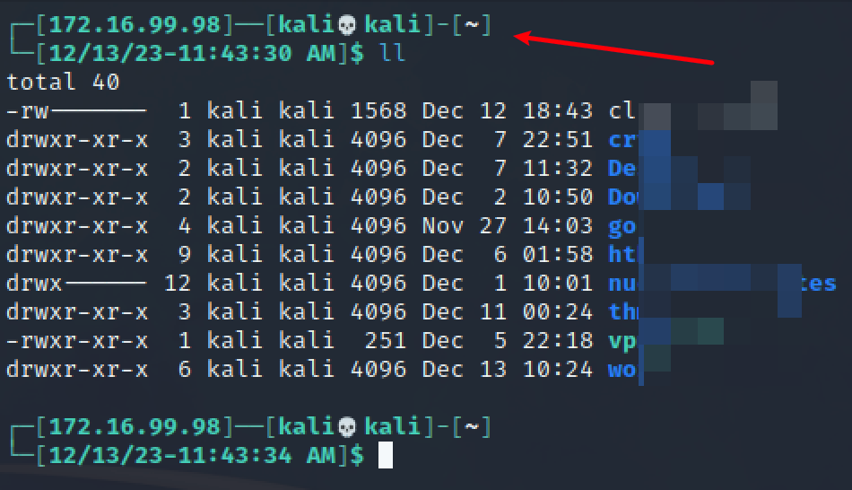

# prompt

Demo



Create file `/home/kali/vpnip.sh`

```bash
#!/bin/sh

interface="$(ip tuntap show | cut -d : -f1 | head -n 1)"
ip="$(ip a s "${interface}" 2>/dev/null \
        | grep -o -P '(?<=inet )[0-9]{1,3}(\.[0-9]{1,3}){3}')"

if [ "${ip}" != "" ]; then
  printf "${ip}"
else
  printf "No Active VPN"
fi
```

Change file `~/.zshrc`

```bash
# line 95 (Adjustment to actual situation)
prompt_symbol=💀

# line 100  (Adjustment to actual situation)
PROMPT=$'%F{%(#.blue.green)}┌─[%B%F{%(#.red.green)}$(/home/kali/vpnip.sh)%b%F{%(#.blue.green)}]──${debian_chroot:+($debian_chroot)─}${VIRTUAL_ENV:+($(basename $VIRTUAL_ENV))─}[%B%F{%(#.red.green)}%n'$prompt_symbol$'%m%b%F{%(#.blue.green)}]-[%B%F{reset}%(6~.%-1~/…/%4~.%5~)%b%F{%(#.blue.green)}]\n└─[%B%F{%(#.red.green)}$(date +%D-%r)%b]%B%(#.%F{red}#.%F{green}$)%b%F{reset} '
```